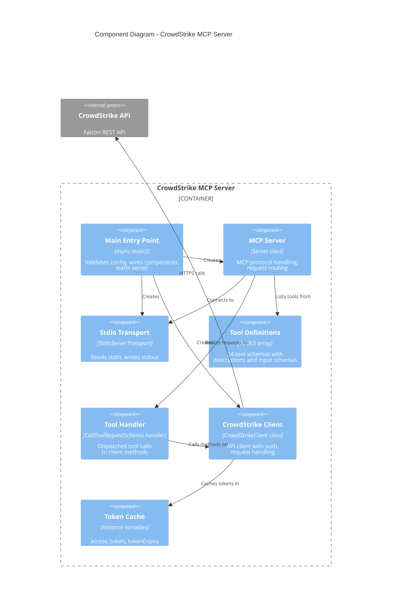
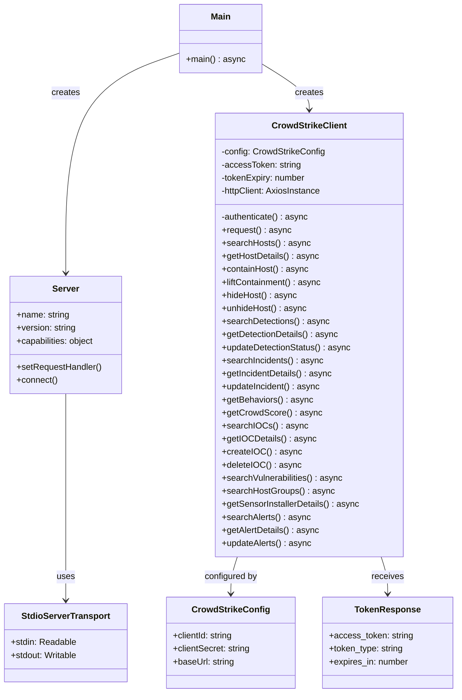
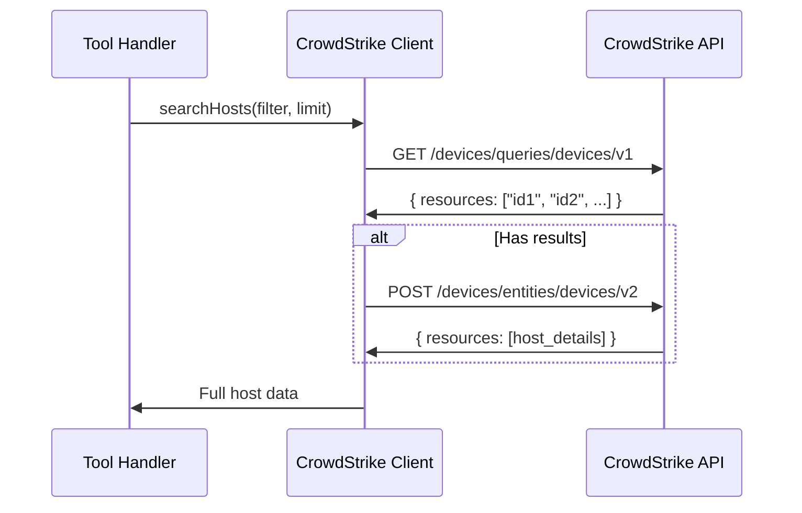
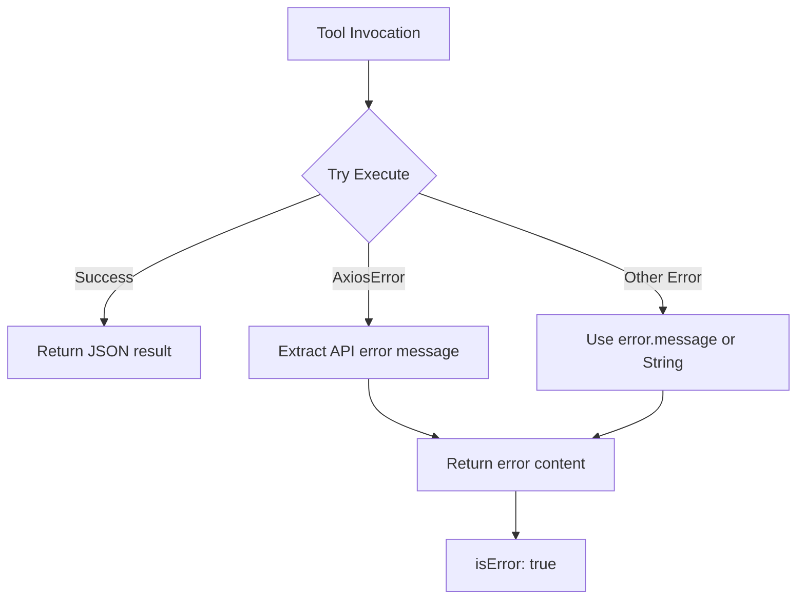

# Component Diagram (C4 Level 3)

## Overview

This document details the internal component structure of the CrowdStrike MCP Server, showing the classes, modules, and their relationships within the single source file (`src/index.ts`).

## Component Diagram

## Internal Structure

## Component Details

### Main Entry Point

**Location**: `src/index.ts` (lines 1099-1347)

**Responsibilities**:
1. Read and validate environment variables
2. Exit with error if credentials missing
3. Instantiate CrowdStrikeClient with config
4. Create MCP Server with metadata
5. Register request handlers (ListTools, CallTool)
6. Connect server to stdio transport

**Error Handling**:
- Missing credentials: `process.exit(1)` with error message to stderr
- Runtime errors: Caught and logged, process exits

### CrowdStrikeClient Class

**Location**: `src/index.ts` (lines 28-532)

**Responsibilities**:
1. **Authentication**: OAuth2 client credentials flow
2. **Token Management**: Cache token, refresh 60s before expiry
3. **HTTP Requests**: Centralized request method with auth header injection
4. **API Methods**: Domain-specific methods for each CrowdStrike API area

**Internal State**:

| Property | Type | Purpose |
|----------|------|---------|
| `config` | CrowdStrikeConfig | Immutable configuration |
| `accessToken` | string | Current OAuth token |
| `tokenExpiry` | number | Token expiry timestamp (ms) |
| `httpClient` | AxiosInstance | Configured Axios client |

### Tool Definitions (TOOLS Array)

**Location**: `src/index.ts` (lines 538-1093)

**Structure**: Array of 24 Tool objects, each with:
- `name`: Unique tool identifier
- `description`: Human-readable description for AI
- `inputSchema`: JSON Schema for parameters

**Tool Categories**:

| Category | Tools | Count |
|----------|-------|-------|
| Hosts | search_hosts, get_host_details, contain_host, lift_containment, hide_host, unhide_host | 6 |
| Detections | search_detections, get_detection_details, update_detection | 3 |
| Incidents | search_incidents, get_incident_details, update_incident, get_behaviors, get_crowdscore | 5 |
| IOCs | search_iocs, get_ioc_details, create_ioc, delete_ioc | 4 |
| Vulnerabilities | search_vulnerabilities | 1 |
| Host Groups | search_host_groups | 1 |
| Sensors | get_sensor_installers | 1 |
| Alerts | search_alerts, get_alert_details, update_alerts | 3 |

### Tool Handler

**Location**: `src/index.ts` (lines 1137-1336)

**Pattern**: Switch statement dispatching on tool name

**Behavior**:
1. Extract tool name and arguments from request
2. Call corresponding CrowdStrikeClient method
3. Return result as JSON text content
4. Return error content with `isError: true` on failure

## API Method Patterns

### Query + Fetch Pattern

Most search methods follow a two-step pattern:

This pattern is used for: Hosts, Detections, Incidents, IOCs, Host Groups

### Direct Fetch Pattern

Some methods directly fetch or mutate:

- `getHostDetails`, `getDetectionDetails`, `getIncidentDetails`, `getIOCDetails`
- `containHost`, `liftContainment`, `updateDetectionStatus`, `updateIncident`
- `createIOC`, `deleteIOC`, `updateAlerts`

### Combined Endpoint Pattern

Some CrowdStrike APIs use combined endpoints that return full data:

- `searchVulnerabilities` (GET /spotlight/combined/vulnerabilities/v1)
- `getSensorInstallerDetails` (GET /sensors/combined/installers/v2)
- `getCrowdScore` (GET /incidents/combined/crowdscores/v1)

## Error Handling

## Dependencies

| Dependency | Version | Purpose |
|------------|---------|---------|
| @modelcontextprotocol/sdk | ^1.0.0 | MCP Server, Transport, Types |
| axios | ^1.6.0 | HTTP client for API calls |
| typescript | ^5.3.0 | Build-time type checking |
| tsx | ^4.7.0 | Development runner |

## Open Questions and Gaps

1. **Single File**: All components in one file (1347 lines); could benefit from modularization
2. **Type Safety**: Many API responses typed as `unknown`; could add response interfaces
3. **Input Validation**: Relies on JSON Schema at MCP level; no runtime validation
4. **Retry Logic**: No retry for transient failures
5. **Pagination**: No automatic pagination for large result sets
