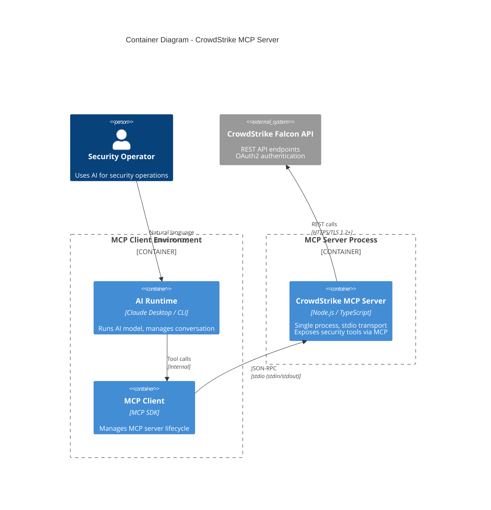
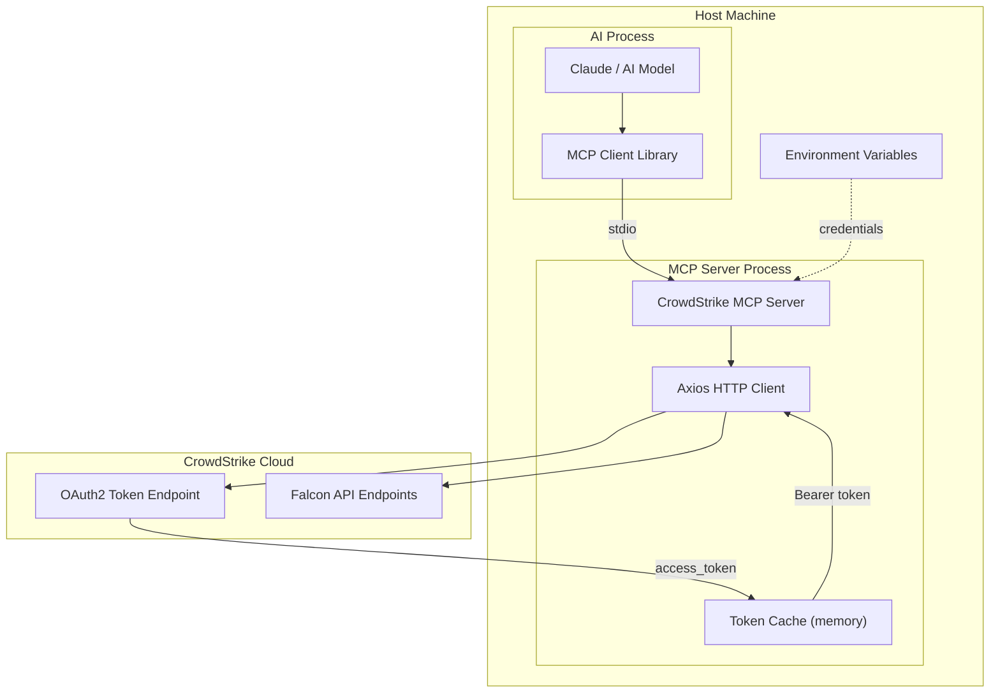
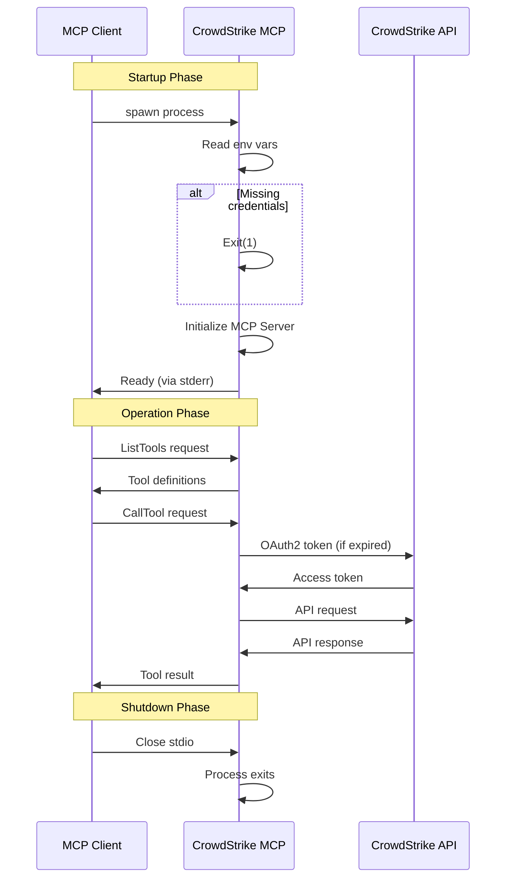

# Container Diagram (C4 Level 2)

## Overview

This document describes the container-level architecture, showing the runtime components and their interactions. In this context, "container" refers to separately runnable/deployable units, not Docker containers.

## Container Diagram

## Runtime View

## Container Details

### CrowdStrike MCP Server

| Property | Value |
|----------|-------|
| **Technology** | Node.js 18+ with TypeScript |
| **Entry Point** | `dist/index.js` (compiled from `src/index.ts`) |
| **Transport** | stdio (StdioServerTransport) |
| **Process Model** | Single process, single thread (event loop) |
| **Memory** | ~50-100MB typical usage |

#### Responsibilities

1. **Tool Registration**: Exposes 24 tools to MCP clients
2. **Request Handling**: Parses MCP requests, validates arguments
3. **Authentication**: Manages OAuth2 token lifecycle
4. **API Translation**: Converts tool calls to CrowdStrike API requests
5. **Response Formatting**: Returns JSON responses to MCP client

### MCP Client (External)

The MCP client is not part of this system but is shown for context:

| Property | Value |
|----------|-------|
| **Examples** | Claude Desktop, Claude CLI, custom MCP clients |
| **Responsibility** | Spawns MCP server, routes tool calls, manages lifecycle |
| **Protocol** | MCP over stdio |

### CrowdStrike Falcon API (External)

| Property | Value |
|----------|-------|
| **Type** | External REST API |
| **Authentication** | OAuth2 Client Credentials |
| **Base URLs** | api.crowdstrike.com (US-1), api.us-2.crowdstrike.com, etc. |
| **Protocol** | HTTPS with TLS 1.2+ |

## Process Lifecycle

## Configuration

### Environment Variables

| Variable | Required | Description | Default |
|----------|----------|-------------|---------|
| `CROWDSTRIKE_CLIENT_ID` | Yes | OAuth2 client ID | - |
| `CROWDSTRIKE_CLIENT_SECRET` | Yes | OAuth2 client secret | - |
| `CROWDSTRIKE_BASE_URL` | No | API base URL | `https://api.crowdstrike.com` |

### Build Configuration

| File | Purpose |
|------|---------|
| `tsconfig.json` | TypeScript compiler options (ES2022, ESM) |
| `package.json` | Dependencies, scripts, metadata |

## Scalability Considerations

| Aspect | Current State | Notes |
|--------|---------------|-------|
| **Horizontal Scaling** | N/A | Single process per AI assistant session |
| **Vertical Scaling** | Low memory footprint | Can handle many sequential requests |
| **Concurrency** | Limited | Node.js event loop; API calls are async |
| **Connection Pooling** | Default Axios | HTTP keep-alive supported |

## Open Questions and Gaps

1. **Process Supervision**: No built-in restart on crash; relies on MCP client
2. **Resource Limits**: No memory or CPU limits enforced at process level
3. **Graceful Shutdown**: Limited; stdio close triggers exit
4. **Health Checks**: No health endpoint (stdio-only transport)
