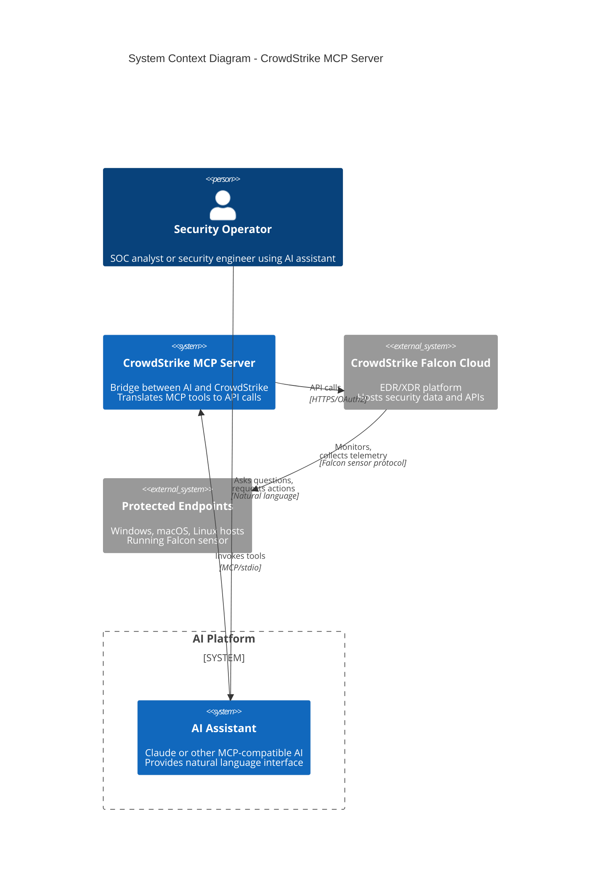

# System Context (C4 Level 1)

## Overview

This document describes the system context for the CrowdStrike MCP Server, showing how it fits within the broader ecosystem of AI assistants, security operations, and the CrowdStrike Falcon platform.

## System Context Diagram

## Context Narrative

### Primary Actors

| Actor | Description | Interaction Mode |
|-------|-------------|-----------------|
| Security Operator | SOC analyst, incident responder, or security engineer | Indirect via AI assistant |
| AI Assistant | Claude or other MCP-compatible AI | MCP protocol over stdio |
| CrowdStrike Falcon | Cloud-based EDR/XDR platform | REST API over HTTPS |

### System Boundaries

1. **AI Platform Boundary**: The AI assistant runs as a separate process, communicating with the MCP server via stdio. The MCP server has no visibility into AI internals.

2. **Trust Boundary**: Credentials (client ID/secret) cross into the MCP server from the environment. The MCP server must protect these credentials from exposure.

3. **Network Boundary**: All communication to CrowdStrike is outbound HTTPS. No inbound connections are required.

### Information Flows

| Flow | From | To | Data | Protocol |
|------|------|-----|------|----------|
| Tool Invocation | AI Assistant | MCP Server | Tool name + JSON args | MCP/JSON-RPC |
| Tool Response | MCP Server | AI Assistant | JSON result or error | MCP/JSON-RPC |
| Authentication | MCP Server | CrowdStrike | Client credentials | OAuth2/HTTPS |
| API Request | MCP Server | CrowdStrike | Query/action parameters | REST/HTTPS |
| API Response | CrowdStrike | MCP Server | Security data/results | JSON/HTTPS |

## Stakeholders

| Stakeholder | Concerns | How Addressed |
|-------------|----------|---------------|
| SOC Analysts | Fast access to security data | Natural language queries via AI |
| Security Engineers | Automation of routine tasks | Tool-based actions for containment, updates |
| Security Architects | API security, credential handling | OAuth2, env-based secrets, no logging of creds |
| Compliance Officers | Audit trail, data protection | All actions logged by CrowdStrike API |
| Platform Team | Reliability, maintainability | TypeScript, minimal deps, clear error handling |

## External Dependencies

| Dependency | Type | Criticality | Failure Impact |
|------------|------|-------------|----------------|
| CrowdStrike API | External service | Critical | Complete loss of functionality |
| CrowdStrike OAuth | External service | Critical | Cannot authenticate, all operations fail |
| Node.js runtime | Platform | Critical | Server cannot start |
| Network connectivity | Infrastructure | Critical | Cannot reach CrowdStrike cloud |

## Constraints

1. **API Rate Limits**: CrowdStrike enforces rate limits; high-volume operations may be throttled
2. **Regional API Endpoints**: Different CrowdStrike clouds (US-1, US-2, EU-1, US-GOV-1) require different base URLs
3. **Permission Scopes**: API client must have appropriate permissions for each API endpoint
4. **MCP Protocol**: Constrained to stdio transport; no HTTP or WebSocket support in this implementation

## Assumptions

1. The AI assistant correctly implements MCP client protocol
2. Network egress to CrowdStrike cloud is permitted
3. API credentials have been provisioned with required scopes
4. The server runs in a trusted execution environment

## Open Questions and Gaps

1. **Multi-tenancy**: Current design assumes single CrowdStrike tenant per server instance
2. **Credential Rotation**: No built-in support for credential rotation during runtime
3. **Circuit Breaker**: No circuit breaker pattern for CrowdStrike API failures
4. **Metrics/Observability**: No built-in metrics export; relies on CrowdStrike API logging
