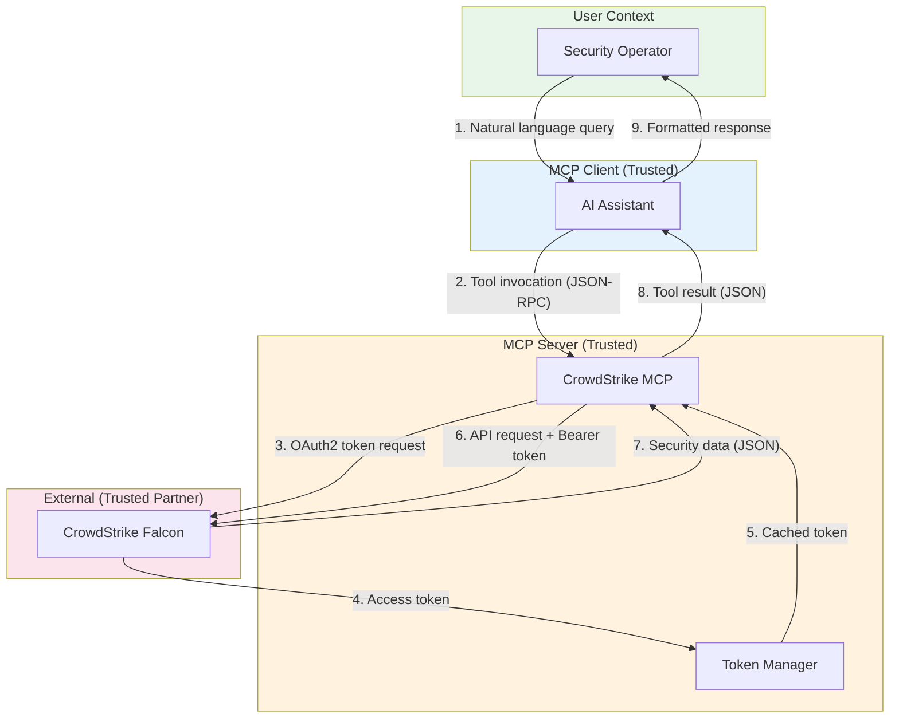
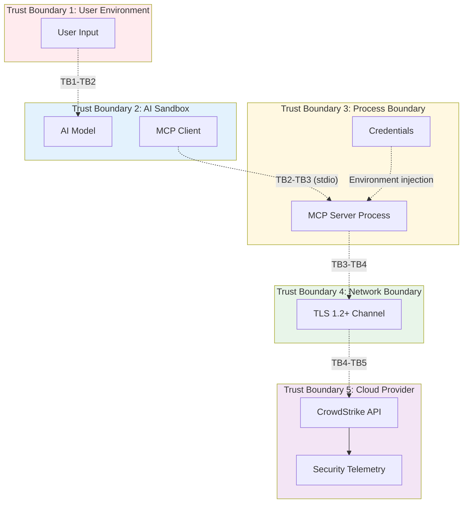
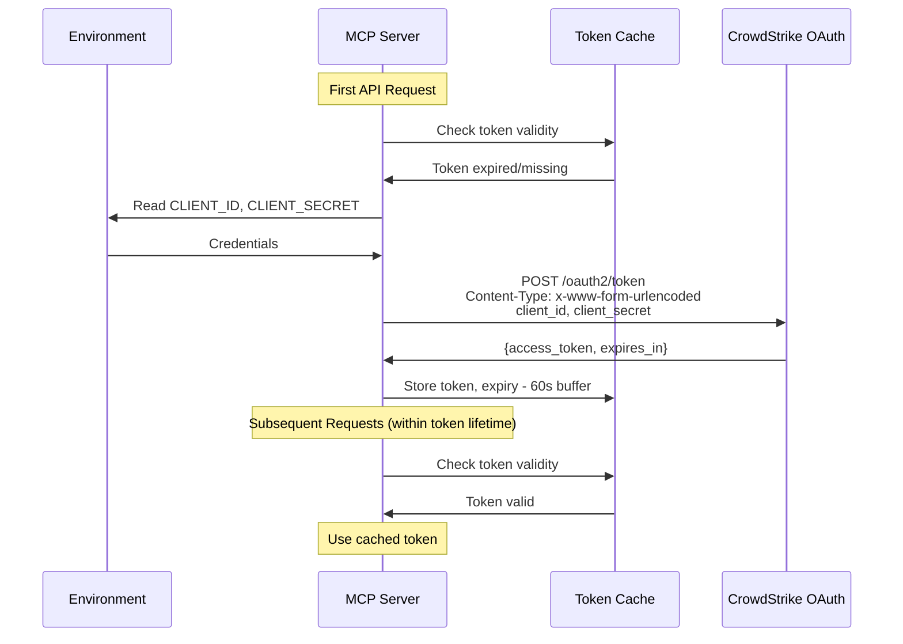
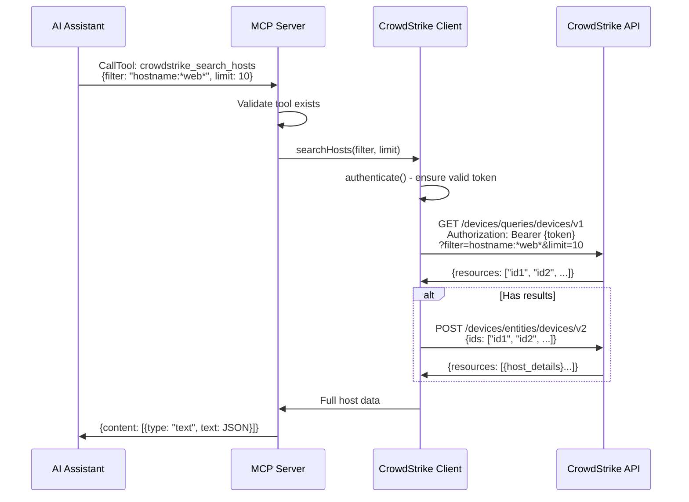
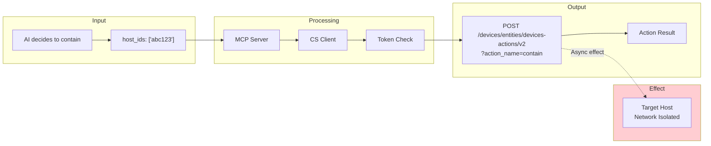
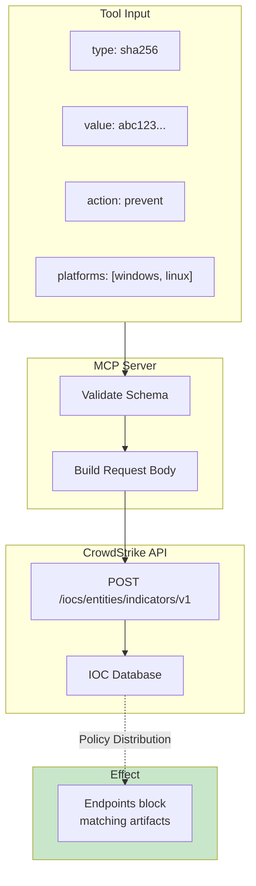
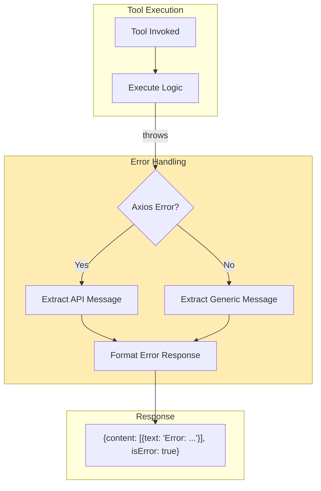

# Data Flow Diagrams

## Overview

This document describes the data flows through the CrowdStrike MCP Server, including trust boundaries and sensitive data paths.

## High-Level Data Flow



## Trust Boundaries



## Sensitive Data Classification

| Data Type | Classification | Location | Protection |
|-----------|---------------|----------|------------|
| Client ID | Secret | Environment variable | Not logged, not transmitted except to OAuth |
| Client Secret | Secret | Environment variable | Not logged, not transmitted except to OAuth |
| Access Token | Secret | In-memory only | Not logged, short-lived (30 min) |
| Host Details | Confidential | Transit only | TLS encrypted, ephemeral |
| Detection Data | Confidential | Transit only | TLS encrypted, ephemeral |
| IOC Values | Confidential | Transit only | TLS encrypted, ephemeral |
| CVE Details | Internal | Transit only | TLS encrypted, ephemeral |

## Authentication Flow



## Tool Invocation Flow



## Data Flow: Host Containment



## Data Flow: IOC Creation



## Error Data Flow



## Data Retention

| Data Type | Retention in MCP | Retention in CrowdStrike |
|-----------|-----------------|--------------------------|
| OAuth Tokens | Until expiry (30 min) | N/A |
| API Responses | None (ephemeral) | Per CrowdStrike policy |
| Tool Arguments | None (ephemeral) | N/A |
| Error Messages | None (ephemeral) | N/A |

## Sensitive Data Paths

### Credentials Path (Most Sensitive)

```
Environment Variable --> Node.js Process Memory --> OAuth Request Body --> TLS --> CrowdStrike
                                                  (never logged)
```

### Token Path

```
CrowdStrike Response --> TLS --> Node.js Memory (tokenCache) --> Authorization Header --> TLS --> CrowdStrike
                                 (max 30 min)                    (never logged)
```

### Security Data Path

```
CrowdStrike Database --> API Response --> TLS --> MCP Server --> JSON-RPC Response --> AI Process
                        (sensitive)              (no storage)    (ephemeral)           (AI context window)
```

## Open Questions and Gaps

1. **PII in Responses**: API responses may contain hostnames, usernames, IPs - no sanitization
2. **Audit Logging**: No local audit log of tool invocations - relies on CrowdStrike API logs
3. **Data Minimization**: Full API responses returned; could filter to essential fields
4. **Token Exposure**: Token held in JavaScript memory; could be exposed via memory dump
5. **Request Logging**: No request/response logging for debugging - trade-off with security
