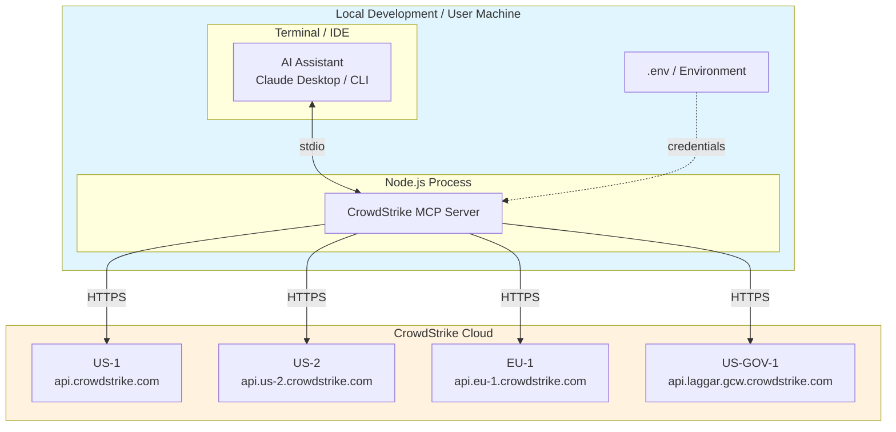
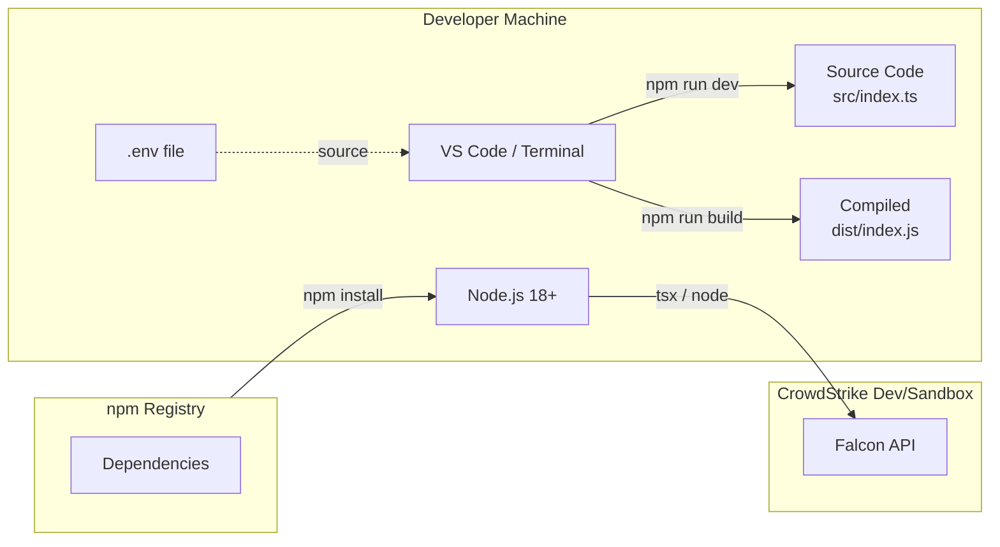
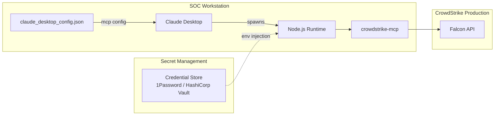
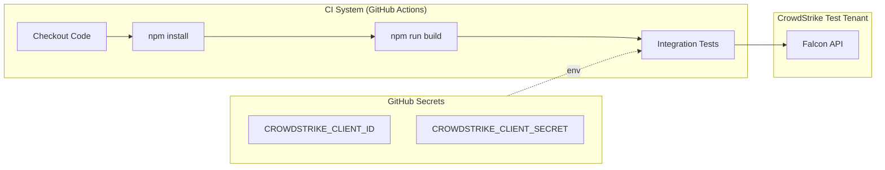

# Deployment Architecture

## Overview

This document describes the deployment model for the CrowdStrike MCP Server across different environments and configurations.

## Deployment Model

The CrowdStrike MCP Server is designed as a local process that runs alongside an MCP client (AI assistant). It is not a network service and does not require hosting infrastructure.



## Environment Matrix

| Environment | Description | CrowdStrike Cloud | Use Case |
|-------------|-------------|-------------------|----------|
| Local Dev | Developer workstation | Sandbox/Dev tenant | Feature development, testing |
| CI | CI/CD pipeline | Test tenant | Automated testing |
| SOC Workstation | Analyst machine | Production tenant | Security operations |
| Automation Server | Headless server | Production tenant | Automated response playbooks |

## Deployment Diagram by Environment

### Local Development



**Setup**:
```bash
# Clone and install
git clone <repo>
cd crowdstrike-mcp
npm install

# Configure credentials (dev tenant)
export CROWDSTRIKE_CLIENT_ID="dev-client-id"
export CROWDSTRIKE_CLIENT_SECRET="dev-client-secret"
export CROWDSTRIKE_BASE_URL="https://api.crowdstrike.com"

# Development mode
npm run dev
```

### Production (SOC Workstation)



**Configuration (claude_desktop_config.json)**:
```json
{
  "mcpServers": {
    "crowdstrike": {
      "command": "node",
      "args": ["/path/to/crowdstrike-mcp/dist/index.js"],
      "env": {
        "CROWDSTRIKE_CLIENT_ID": "${CROWDSTRIKE_CLIENT_ID}",
        "CROWDSTRIKE_CLIENT_SECRET": "${CROWDSTRIKE_CLIENT_SECRET}",
        "CROWDSTRIKE_BASE_URL": "https://api.crowdstrike.com"
      }
    }
  }
}
```

### CI/CD Pipeline



**Example GitHub Actions Workflow**:
```yaml
name: CI
on: [push, pull_request]

jobs:
  build:
    runs-on: ubuntu-latest
    steps:
      - uses: actions/checkout@v4
      - uses: actions/setup-node@v4
        with:
          node-version: '20'
      - run: npm ci
      - run: npm run build

  integration-test:
    needs: build
    runs-on: ubuntu-latest
    env:
      CROWDSTRIKE_CLIENT_ID: ${{ secrets.CROWDSTRIKE_CLIENT_ID }}
      CROWDSTRIKE_CLIENT_SECRET: ${{ secrets.CROWDSTRIKE_CLIENT_SECRET }}
      CROWDSTRIKE_BASE_URL: https://api.crowdstrike.com
    steps:
      - uses: actions/checkout@v4
      - uses: actions/setup-node@v4
        with:
          node-version: '20'
      - run: npm ci
      - run: npm run build
      - run: npm test
```

## Network Requirements

### Outbound Connections

| Destination | Port | Protocol | Purpose |
|-------------|------|----------|---------|
| api.crowdstrike.com | 443 | HTTPS | US-1 API |
| api.us-2.crowdstrike.com | 443 | HTTPS | US-2 API |
| api.eu-1.crowdstrike.com | 443 | HTTPS | EU-1 API |
| api.laggar.gcw.crowdstrike.com | 443 | HTTPS | US-GOV-1 API |

### Inbound Connections

None required. The MCP server is a local process communicating via stdio.

### Proxy Configuration

If operating behind a corporate proxy, configure via standard Node.js environment variables:

```bash
export HTTP_PROXY="http://proxy.corp.example.com:8080"
export HTTPS_PROXY="http://proxy.corp.example.com:8080"
export NO_PROXY="localhost,127.0.0.1"
```

## CrowdStrike Cloud Regions

| Region | Base URL | Notes |
|--------|----------|-------|
| US-1 | https://api.crowdstrike.com | Default, US East |
| US-2 | https://api.us-2.crowdstrike.com | US West |
| EU-1 | https://api.eu-1.crowdstrike.com | EU (Frankfurt) |
| US-GOV-1 | https://api.laggar.gcw.crowdstrike.com | FedRAMP High |

**Note**: Tenant region is determined at provisioning. Use the correct base URL for your tenant.

## Runtime Requirements

| Requirement | Minimum | Recommended |
|-------------|---------|-------------|
| Node.js | 18.x | 20.x LTS |
| Memory | 64 MB | 128 MB |
| Disk | 50 MB (with deps) | 100 MB |
| Network | 1 Mbps | 10 Mbps |

## Artifact Structure

```
crowdstrike-mcp/
├── dist/
│   ├── index.js          # Compiled JavaScript (entry point)
│   ├── index.js.map      # Source map
│   ├── index.d.ts        # TypeScript declarations
│   └── index.d.ts.map    # Declaration map
├── src/
│   └── index.ts          # Source TypeScript
├── node_modules/         # Dependencies
├── package.json          # Project manifest
├── package-lock.json     # Dependency lock
└── tsconfig.json         # TypeScript config
```

## High Availability Considerations

The MCP server is designed for interactive use, not high availability:

| Aspect | Current State | For HA (if needed) |
|--------|---------------|-------------------|
| Redundancy | Single process | Multiple AI sessions |
| Failover | Process restart | MCP client handles |
| State | Stateless | No state to replicate |
| Load Balancing | N/A | Not applicable (stdio) |

## Open Questions and Gaps

1. **Containerization**: No Dockerfile provided; could add for consistent deployment
2. **Version Pinning**: Uses semver ranges; could pin exact versions for reproducibility
3. **Health Monitoring**: No health endpoint; relies on process monitoring
4. **Log Aggregation**: stderr only; no structured logging or log forwarding
5. **Credential Rotation**: Requires process restart to pick up new credentials
