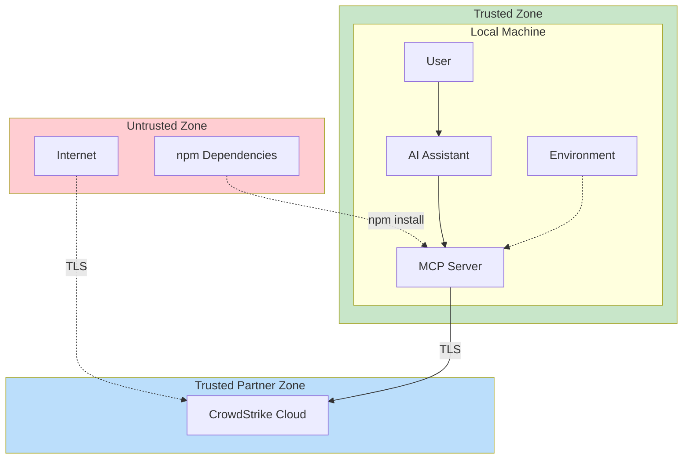
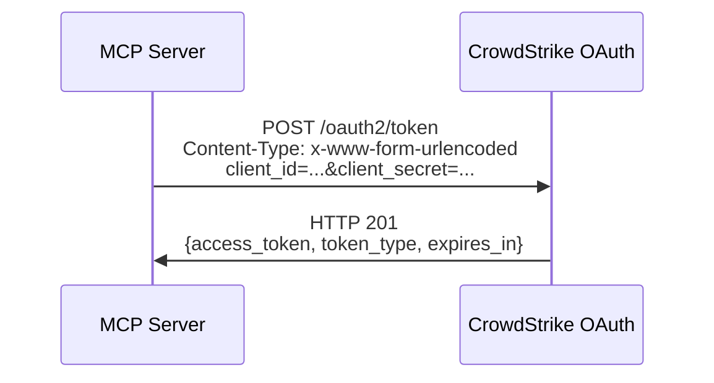
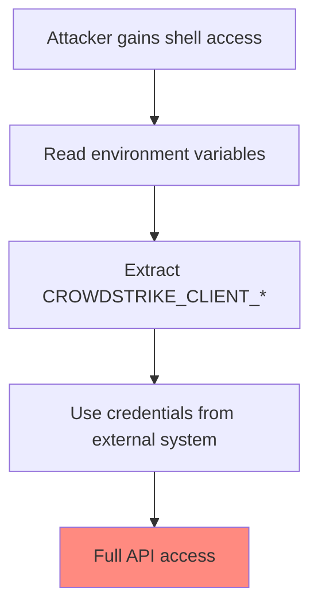
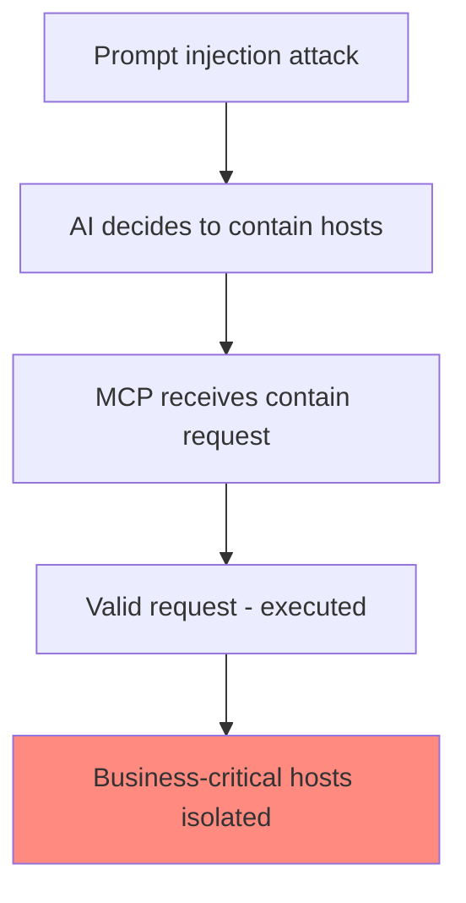
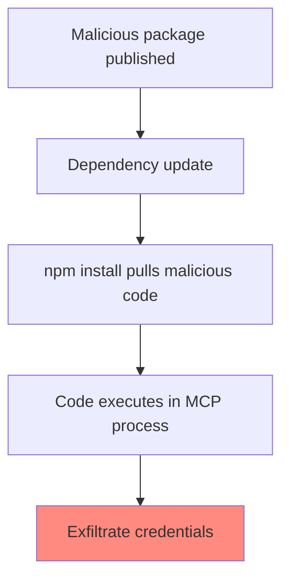

# Security Architecture

## Overview

This document provides a comprehensive security analysis of the CrowdStrike MCP Server, including threat modeling, security controls, and recommendations.

## Threat Model Summary

### Assets

| Asset | Value | Protection Priority |
|-------|-------|---------------------|
| CrowdStrike API Credentials | Critical | Highest |
| OAuth Access Tokens | High | High |
| Security Operations Data | High | High |
| Host Containment Capability | High | High |
| IOC Management Capability | Medium | Medium |
| Vulnerability Data | Medium | Medium |

### Adversaries

| Adversary | Capability | Motivation | Likelihood |
|-----------|------------|------------|------------|
| Malicious Insider | High (has environment access) | Data theft, sabotage | Medium |
| Compromised AI | Medium (can invoke tools) | Unauthorized actions | Low-Medium |
| Credential Thief | Medium | API access, lateral movement | Medium |
| Network Attacker | Medium | MITM, credential interception | Low (TLS) |
| Supply Chain Attacker | Low-Medium | Backdoor, data exfiltration | Low |

### Trust Boundaries

## Threat Analysis (STRIDE)

### Spoofing

| Threat | Risk | Mitigation |
|--------|------|------------|
| Attacker impersonates MCP server | Low | MCP client spawns server directly |
| Attacker obtains valid credentials | High | Environment variable isolation, secret management |
| Stolen token used for API access | Medium | Tokens are short-lived (30 min) |

### Tampering

| Threat | Risk | Mitigation |
|--------|------|------------|
| Modified MCP responses | Low | stdio is process-local |
| MITM on API traffic | Low | TLS 1.2+ required |
| Compromised dependencies | Medium | Lock file, minimal deps |

### Repudiation

| Threat | Risk | Mitigation |
|--------|------|------------|
| Denial of security actions | Medium | CrowdStrike API audit logs |
| No local audit trail | Gap | Recommendation: Add local logging |

### Information Disclosure

| Threat | Risk | Mitigation |
|--------|------|------------|
| Credential leakage in logs | Low | Never logged (verified in code) |
| Token in memory dumps | Medium | Short token lifetime |
| Security data in AI context | Medium | AI context isolation |

### Denial of Service

| Threat | Risk | Mitigation |
|--------|------|------------|
| API rate limiting | Medium | CrowdStrike enforces limits |
| Process resource exhaustion | Low | Low resource footprint |

### Elevation of Privilege

| Threat | Risk | Mitigation |
|--------|------|------------|
| AI requests unauthorized actions | Medium | API permissions are scoped |
| Tool abuse for mass containment | Medium | Requires explicit host IDs |

## Security Controls

### Authentication and Authorization

| Control | Implementation | Status |
|---------|---------------|--------|
| OAuth2 Client Credentials | CrowdStrike OAuth | Implemented |
| Token Refresh | 60-second buffer before expiry | Implemented |
| API Permissions | Scoped at API client creation | External |
| No User Authentication | N/A (process-local) | By Design |

**OAuth2 Flow**:

### Credential Management

| Aspect | Current State | Recommendation |
|--------|---------------|----------------|
| Storage | Environment variables | Use secret manager (Vault, 1Password) |
| Rotation | Manual restart required | Implement rotation without restart |
| Logging | Never logged | Verified |
| Transmission | OAuth endpoint only | Verified |

### Data Protection

| Data Type | In Transit | At Rest | Notes |
|-----------|-----------|---------|-------|
| Credentials | TLS 1.2+ | Environment | Not stored in files |
| Access Tokens | TLS 1.2+ | Memory only | 30 min lifetime |
| API Data | TLS 1.2+ | None | Ephemeral processing |

### Input Validation

| Validation Layer | Implementation |
|-----------------|----------------|
| MCP Schema | JSON Schema in tool definitions |
| TypeScript Types | Compile-time checking |
| Runtime Validation | Minimal (relies on schema) |
| API-side | CrowdStrike validates all inputs |

### Error Handling

| Error Type | Handling | Information Leakage Risk |
|------------|----------|-------------------------|
| Auth Failure | Error message returned | Low (generic message) |
| API Error | CrowdStrike error message | Low (controlled by API) |
| Unknown Tool | Error with tool name | Low |
| Runtime Error | Generic error message | Low |

## Attack Scenarios

### Scenario 1: Credential Theft

**Mitigations**:
1. Use a secret manager instead of plain environment variables
2. Enable CrowdStrike API key rotation
3. Monitor for unauthorized API access
4. Limit API key permissions to minimum required

### Scenario 2: Malicious AI Tool Invocation

**Mitigations**:
1. API permissions should exclude destructive actions if not needed
2. Implement rate limiting on containment actions
3. Alert on bulk containment operations
4. Use CrowdStrike Response Policies for additional controls

### Scenario 3: Supply Chain Attack

**Mitigations**:
1. Use package-lock.json for exact versions
2. Enable npm audit in CI/CD
3. Consider using npm audit signatures
4. Minimal dependencies (only 2 direct deps)

## Security Hardening Checklist

### Credential Security
- [ ] Use secret manager (Vault, 1Password CLI, etc.)
- [ ] Enable credential rotation
- [ ] Set minimum required API scopes
- [ ] Audit API client permissions quarterly

### Process Security
- [ ] Run as non-root user
- [ ] Use minimal container image if containerized
- [ ] Enable process monitoring
- [ ] Implement resource limits

### Network Security
- [ ] Verify TLS certificate validation is enabled (default in Node.js)
- [ ] Configure proxy if required
- [ ] Block unnecessary outbound destinations
- [ ] Monitor for unusual API call patterns

### Code Security
- [ ] Enable npm audit in CI/CD
- [ ] Pin dependency versions
- [ ] Review code changes before merge
- [ ] Use TypeScript strict mode (enabled)

### Monitoring
- [ ] Enable CrowdStrike API audit logging
- [ ] Monitor for failed auth attempts
- [ ] Alert on unusual tool invocation patterns
- [ ] Track API rate limit usage

## API Permission Scopes

The CrowdStrike API client should be provisioned with minimum required scopes:

| Scope | Tools Requiring | Risk Level |
|-------|-----------------|------------|
| Hosts: Read | search_hosts, get_host_details | Low |
| Hosts: Write | contain_host, lift_containment, hide/unhide | High |
| Detections: Read | search_detections, get_detection_details | Low |
| Detections: Write | update_detection | Medium |
| Incidents: Read | search_incidents, get_incident_details, get_behaviors, get_crowdscore | Low |
| Incidents: Write | update_incident | Medium |
| IOC Management: Read | search_iocs, get_ioc_details | Low |
| IOC Management: Write | create_ioc, delete_ioc | Medium |
| Spotlight: Read | search_vulnerabilities | Low |
| Host Groups: Read | search_host_groups | Low |
| Sensor Installers: Read | get_sensor_installers | Low |
| Alerts: Read | search_alerts, get_alert_details | Low |
| Alerts: Write | update_alerts | Medium |

**Recommendation**: Create separate API clients with read-only and read-write scopes for different use cases.

## Compliance Considerations

| Framework | Relevant Controls | Notes |
|-----------|------------------|-------|
| SOC 2 | Access Control, Encryption | TLS, OAuth2 |
| PCI-DSS | 3.4, 4.1, 8.2 | If processing payment hosts |
| HIPAA | 164.312 | If processing healthcare hosts |
| FedRAMP | AC, SC, AU | Use US-GOV-1 endpoint |

## Open Questions and Gaps

1. **Local Audit Logging**: No local record of tool invocations
   - *Recommendation*: Add structured logging with rotation

2. **Credential Rotation**: Requires process restart
   - *Recommendation*: Implement credential refresh mechanism

3. **Rate Limiting**: No client-side rate limiting
   - *Recommendation*: Add rate limiter to prevent API exhaustion

4. **Input Sanitization**: Minimal beyond JSON Schema
   - *Recommendation*: Add FQL injection prevention

5. **Secrets in Memory**: Token stored as plain string
   - *Recommendation*: Consider secure memory patterns (low priority given short lifetime)

6. **SBOM**: No software bill of materials
   - *Recommendation*: Generate SBOM during build
