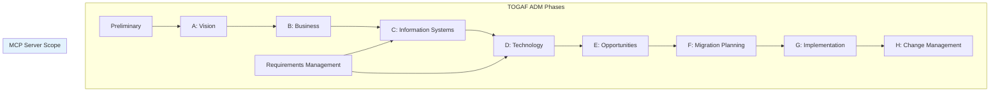
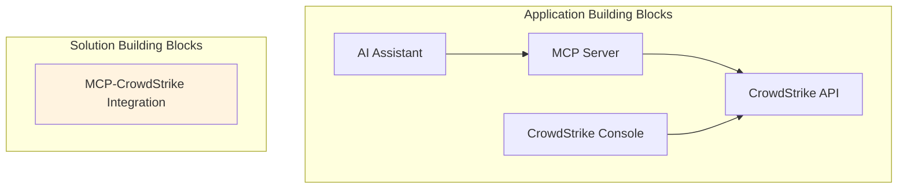
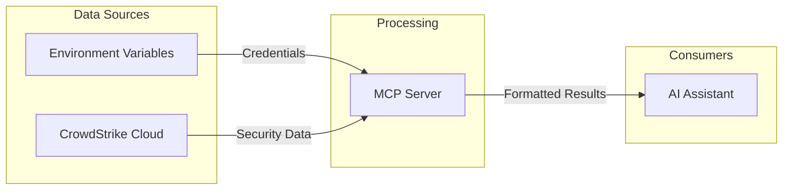
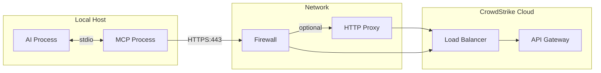

# TOGAF Architecture Mapping

## Overview

This document maps the CrowdStrike MCP Server architecture to TOGAF (The Open Group Architecture Framework) architecture domains and views.

## TOGAF Architecture Development Method (ADM) Context

The CrowdStrike MCP Server represents a **Technology Extension** within an enterprise architecture, enabling AI-driven security operations automation.



## Business Architecture (Phase B)

### Stakeholders

| Stakeholder | Role | Concerns |
|-------------|------|----------|
| SOC Manager | Decision Maker | Team efficiency, mean time to respond |
| SOC Analyst | User | Fast access to data, automation of routine tasks |
| Security Architect | Technical Authority | Integration security, API governance |
| Platform Engineering | Builder | Deployment, maintenance, reliability |
| CISO | Executive Sponsor | Risk reduction, compliance, cost |
| Compliance Officer | Governance | Audit trails, data protection |

### Business Drivers

| Driver | Description | How MCP Addresses |
|--------|-------------|-------------------|
| Reduce MTTR | Faster incident response | Natural language queries, automated containment |
| Analyst Efficiency | More value from existing staff | AI handles routine lookups and triage |
| Skill Gap | Shortage of security talent | AI assists with complex queries |
| Automation | Reduce manual, repetitive work | Tool-based actions for common operations |

### Business Capabilities

| Capability | Current State | With MCP Server |
|------------|---------------|-----------------|
| Threat Detection | Manual console queries | AI-assisted, conversational |
| Incident Investigation | Multi-step, multi-screen | Single conversation flow |
| Containment Actions | Manual, requires console access | Automated via tool invocation |
| IOC Management | Manual API or console | Natural language creation/search |
| Vulnerability Assessment | Scheduled reports | On-demand conversational queries |

### Constraints

| Constraint | Impact | Mitigation |
|------------|--------|------------|
| CrowdStrike API Rate Limits | High-volume operations throttled | Batch operations, caching |
| API Permission Model | Limited by provisioned scopes | Request appropriate scopes |
| Data Residency | Regional API endpoints required | Configure correct base URL |
| Network Connectivity | Requires outbound HTTPS | Proxy support available |

## Application Architecture (Phase C - Applications)

### Application Building Blocks



### Service Contracts

| Service | Provider | Consumer | Interface |
|---------|----------|----------|-----------|
| Tool Listing | MCP Server | AI Assistant | ListToolsRequest/Response |
| Tool Execution | MCP Server | AI Assistant | CallToolRequest/Response |
| Authentication | CrowdStrike | MCP Server | OAuth2 Client Credentials |
| Security APIs | CrowdStrike | MCP Server | REST/JSON |

### Application Interfaces

#### MCP Interface (Inbound)

| Method | Description | Data |
|--------|-------------|------|
| ListTools | Return available tools | Tool[] with schemas |
| CallTool | Execute a tool | name, arguments -> result |

#### CrowdStrike Interface (Outbound)

| API Group | Endpoints | Operations |
|-----------|-----------|------------|
| Devices | /devices/* | Query, contain, hide |
| Detections | /detects/* | Query, update |
| Incidents | /incidents/* | Query, update, behaviors, crowdscore |
| IOCs | /iocs/* | Query, create, delete |
| Spotlight | /spotlight/* | Query vulnerabilities |
| Sensors | /sensors/* | Query installers |
| Alerts | /alerts/* | Query, update |

## Data Architecture (Phase C - Data)

### Data Entities

| Entity | Source | Classification | Retention |
|--------|--------|---------------|-----------|
| Host | CrowdStrike | Internal | Ephemeral |
| Detection | CrowdStrike | Confidential | Ephemeral |
| Incident | CrowdStrike | Confidential | Ephemeral |
| IOC | CrowdStrike | Internal | Ephemeral |
| Vulnerability | CrowdStrike | Internal | Ephemeral |
| Alert | CrowdStrike | Confidential | Ephemeral |
| Access Token | CrowdStrike OAuth | Secret | 30 minutes |
| Credentials | Environment | Secret | Process lifetime |

### Data Flow (Conceptual)



### Data Stores

| Store | Type | Data | Persistence |
|-------|------|------|-------------|
| Token Cache | In-memory | OAuth token, expiry | Process lifetime |
| N/A | None | No persistent storage | N/A |

### Data Lineage

```
CrowdStrike Sensors --> CrowdStrike Cloud --> Falcon API --> MCP Server --> AI Assistant --> User
     (source)              (aggregation)      (exposure)    (translation)    (presentation)
```

## Technology Architecture (Phase D)

### Technology Building Blocks

| TBB | Component | Version | Purpose |
|-----|-----------|---------|---------|
| Runtime | Node.js | 18+ LTS | JavaScript execution |
| Language | TypeScript | 5.3+ | Type-safe development |
| Protocol | MCP SDK | 1.0+ | MCP implementation |
| HTTP | Axios | 1.6+ | REST client |
| OS | macOS/Linux/Windows | Any | Host platform |

### Platform Services

| Service | Provider | Usage |
|---------|----------|-------|
| OAuth2 Token Service | CrowdStrike | Authentication |
| REST API | CrowdStrike | Security operations |
| Process Management | MCP Client | Server lifecycle |
| Secret Management | Environment/Vault | Credentials |

### Network Architecture



### Hosting Model

| Aspect | Description |
|--------|-------------|
| Compute | Local process on user workstation |
| Storage | None (stateless) |
| Network | Outbound HTTPS only |
| Identity | Environment-injected credentials |

## Security Architecture

### Security Patterns

| Pattern | Implementation |
|---------|----------------|
| Defense in Depth | Multiple trust boundaries |
| Least Privilege | Scoped API permissions |
| Secure by Default | TLS required, creds from env |
| Fail Secure | Exit on auth failure |

### Security Controls Mapping

| Control Category | Controls |
|-----------------|----------|
| Access Control | OAuth2, API scopes, process isolation |
| Data Protection | TLS 1.2+, no persistence, memory-only tokens |
| Audit | CrowdStrike API logging |
| Secrets Management | Environment variables (extensible to Vault) |

## Architecture Principles

| Principle | Description | Application |
|-----------|-------------|-------------|
| Minimal Footprint | Small, focused components | Single-purpose MCP server |
| Statelessness | No local state | All data from CrowdStrike |
| Secure Defaults | Security without configuration | TLS, OAuth, no logging of secrets |
| Transparency | Clear error messages | Error details returned to AI |
| Maintainability | Simple, readable code | TypeScript, minimal deps |

## Gap Analysis

| Current State | Target State | Gap | Priority |
|---------------|--------------|-----|----------|
| Environment credentials | Secret manager | Medium | High |
| No local logging | Structured audit logs | Low | Medium |
| Single file structure | Modular components | Low | Low |
| Manual deployment | Containerized | Low | Medium |
| No metrics | Observability | Low | Medium |

## Roadmap Recommendations

### Phase 1: Security Hardening
- Integrate with secret manager (Vault, 1Password)
- Add structured logging with sensitive data redaction
- Generate SBOM

### Phase 2: Operability
- Add health check mechanism
- Implement metrics export (Prometheus compatible)
- Create Docker container

### Phase 3: Extensibility
- Modularize code structure
- Add plugin architecture for custom tools
- Support additional CrowdStrike APIs

## Open Questions and Gaps

1. **Enterprise Integration**: How does this fit into broader SOAR/SIEM architecture?
2. **Multi-tenant**: Single tenant per instance; enterprise may need multi-tenant
3. **Workflow Orchestration**: No built-in workflow; relies on AI reasoning
4. **Approval Workflows**: No human-in-the-loop for destructive actions
5. **Cost Attribution**: No mechanism to track usage/cost per user or team
